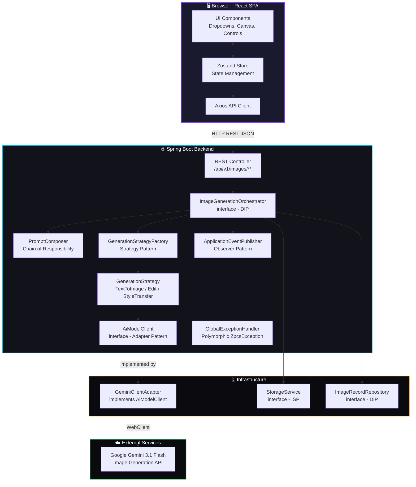
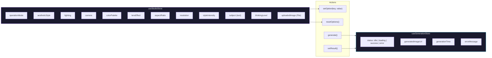
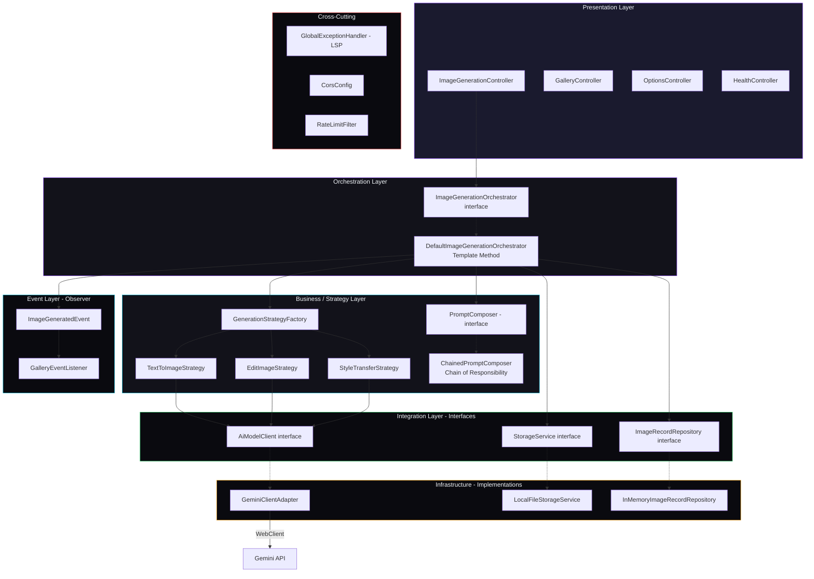
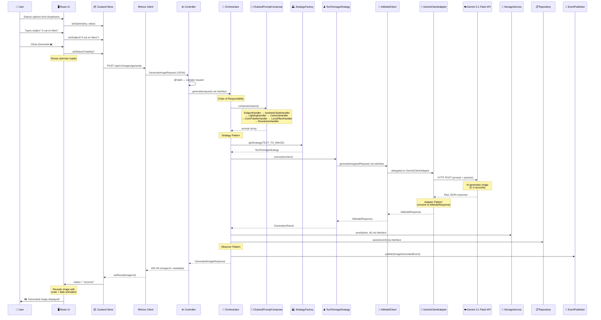
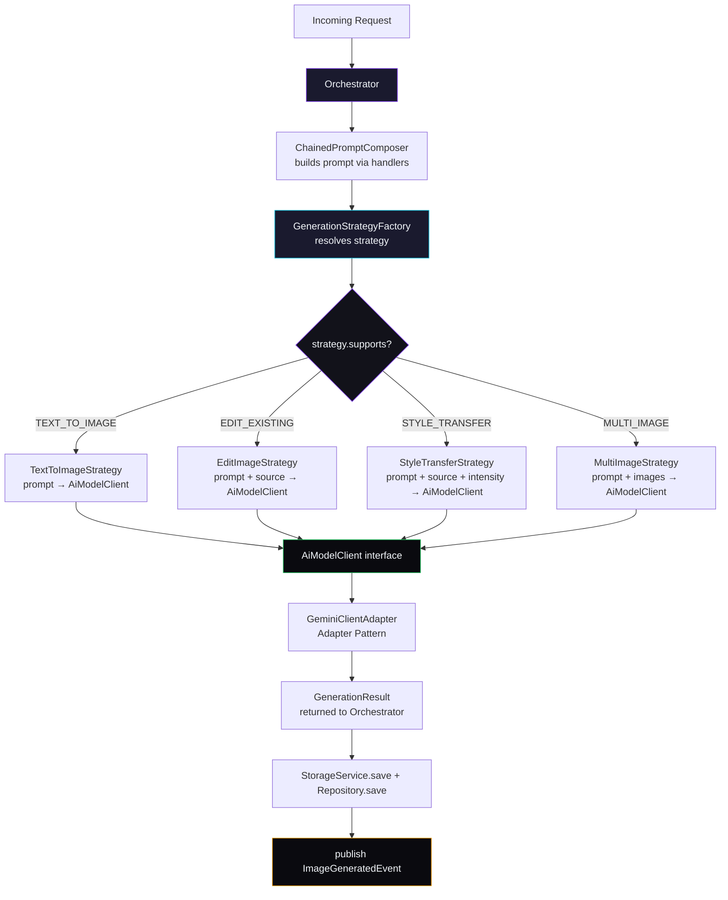
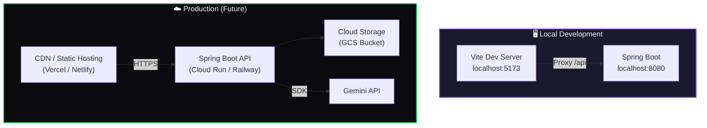

# 🏗️ Zero-Prompt Creative Studio — Architecture Design

## Table of Contents

- [1. Monorepo Structure](#1-monorepo-structure)
- [2. High-Level System Architecture](#2-high-level-system-architecture)
- [3. Frontend Architecture](#3-frontend-architecture)
- [4. Backend Architecture](#4-backend-architecture)
- [5. Data Flow](#5-data-flow)
- [6. API Contract](#6-api-contract)
- [7. Deployment Architecture](#7-deployment-architecture)

---

## 1. Monorepo Structure

```
Zero-Prompt-Creative-Studio/
├── frontend/                        # React application
│   ├── public/
│   │   └── index.html
│   ├── src/
│   │   ├── api/                     # API client layer
│   │   │   ├── axiosClient.ts       # Axios instance with interceptors
│   │   │   └── imageApi.ts          # Image generation API calls
│   │   ├── assets/                  # Static assets (icons, fonts)
│   │   ├── components/              # Reusable UI components
│   │   │   ├── common/              # Buttons, Inputs, Modals
│   │   │   ├── canvas/              # Image display, Canvas area
│   │   │   ├── controls/            # Dropdowns, Sliders, Toggles
│   │   │   └── layout/              # Header, Sidebar, Footer
│   │   ├── hooks/                   # Custom React hooks
│   │   ├── pages/                   # Page-level components
│   │   │   ├── StudioPage.tsx       # Main creative studio
│   │   │   ├── GalleryPage.tsx      # History / gallery view
│   │   │   └── SettingsPage.tsx     # API key & preferences
│   │   ├── store/                   # Zustand state management
│   │   │   ├── useStudioStore.ts    # Studio options state
│   │   │   ├── useGenerationStore.ts# Generation status state
│   │   │   └── useAuthStore.ts      # Auth state
│   │   ├── styles/                  # CSS design system
│   │   │   ├── index.css            # Global styles + CSS variables
│   │   │   ├── glass.css            # Glassmorphism utilities
│   │   │   └── animations.css       # Micro-animation keyframes
│   │   ├── types/                   # TypeScript type definitions
│   │   │   └── studio.types.ts
│   │   ├── utils/                   # Helper utilities
│   │   ├── App.tsx
│   │   └── main.tsx
│   ├── package.json
│   ├── tsconfig.json
│   └── vite.config.ts
│
├── backend/                         # Spring Boot application
│   ├── src/
│   │   ├── main/
│   │   │   ├── java/com/zpcs/
│   │   │   │   ├── ZpcsApplication.java
│   │   │   │   ├── config/
│   │   │   │   │   ├── AsyncConfig.java           # Thread pool for @Async generation
│   │   │   │   │   ├── CorsConfig.java
│   │   │   │   │   ├── WebClientConfig.java
│   │   │   │   │   ├── GeminiProperties.java      # @ConfigurationProperties (type-safe)
│   │   │   │   │   └── StorageProperties.java
│   │   │   │   ├── controller/
│   │   │   │   │   ├── ImageGenerationController.java
│   │   │   │   │   ├── GalleryController.java
│   │   │   │   │   ├── OptionsController.java     # GET /api/v1/options
│   │   │   │   │   └── HealthController.java
│   │   │   │   ├── dto/
│   │   │   │   │   ├── request/
│   │   │   │   │   │   ├── GenerateImageRequest.java
│   │   │   │   │   │   └── EditImageRequest.java
│   │   │   │   │   └── response/
│   │   │   │   │       ├── GeneratedImageResponse.java
│   │   │   │   │       ├── ImageMetadata.java
│   │   │   │   │       └── ErrorResponse.java
│   │   │   │   ├── orchestrator/                   # ← Interfaces + Orchestrator (DIP)
│   │   │   │   │   ├── ImageGenerationOrchestrator.java     # Interface
│   │   │   │   │   └── DefaultImageGenerationOrchestrator.java
│   │   │   │   ├── strategy/                       # ← Strategy Pattern (OCP)
│   │   │   │   │   ├── GenerationStrategy.java              # Interface
│   │   │   │   │   ├── GenerationStrategyFactory.java
│   │   │   │   │   ├── TextToImageStrategy.java
│   │   │   │   │   ├── EditImageStrategy.java
│   │   │   │   │   └── StyleTransferStrategy.java
│   │   │   │   ├── prompt/                         # ← Chain of Responsibility (OCP)
│   │   │   │   │   ├── PromptComposer.java                  # Interface
│   │   │   │   │   ├── ChainedPromptComposer.java
│   │   │   │   │   ├── PromptBuilder.java                   # Builder Pattern
│   │   │   │   │   ├── PromptFragmentHandler.java            # Interface
│   │   │   │   │   └── handlers/
│   │   │   │   │       ├── SubjectHandler.java
│   │   │   │   │       ├── AestheticStyleHandler.java
│   │   │   │   │       ├── LightingHandler.java
│   │   │   │   │       ├── CameraHandler.java
│   │   │   │   │       ├── ColorPaletteHandler.java
│   │   │   │   │       ├── LensEffectHandler.java
│   │   │   │   │       └── ResolutionHandler.java
│   │   │   │   ├── client/                         # ← Adapter Pattern (DIP)
│   │   │   │   │   ├── AiModelClient.java                   # Interface
│   │   │   │   │   ├── GeminiClientAdapter.java
│   │   │   │   │   └── GeminiResponseParser.java
│   │   │   │   ├── storage/                        # ← Repository + Storage (ISP)
│   │   │   │   │   ├── StorageService.java                  # Interface
│   │   │   │   │   ├── LocalFileStorageService.java
│   │   │   │   │   ├── ImageRecordRepository.java           # Interface
│   │   │   │   │   └── InMemoryImageRecordRepository.java
│   │   │   │   ├── service/
│   │   │   │   │   ├── GalleryService.java
│   │   │   │   │   └── OptionsProvider.java
│   │   │   │   ├── event/                          # ← Observer Pattern
│   │   │   │   │   ├── ImageGeneratedEvent.java
│   │   │   │   │   └── GalleryEventListener.java
│   │   │   │   ├── model/
│   │   │   │   │   ├── GenerationContext.java       # @Value @Builder (immutable)
│   │   │   │   │   ├── GenerationResult.java
│   │   │   │   │   ├── AiModelRequest.java
│   │   │   │   │   ├── AiModelResponse.java
│   │   │   │   │   ├── ImageRecord.java
│   │   │   │   │   ├── GeminiRequestConfig.java
│   │   │   │   │   ├── PromptDescribable.java       # Interface for enum self-mapping
│   │   │   │   │   └── enums/
│   │   │   │   │       ├── AestheticStyle.java       # implements PromptDescribable
│   │   │   │   │       ├── LightingSetup.java
│   │   │   │   │       ├── CameraComposition.java
│   │   │   │   │       ├── ColorPalette.java
│   │   │   │   │       ├── LensEffect.java
│   │   │   │   │       ├── AspectRatio.java
│   │   │   │   │       ├── ResolutionQuality.java
│   │   │   │   │       ├── StyleIntensity.java
│   │   │   │   │       ├── OperationMode.java
│   │   │   │   │       └── ThinkingLevel.java
│   │   │   │   └── exception/                      # ← Polymorphic hierarchy (LSP)
│   │   │   │       ├── ZpcsException.java            # Abstract base
│   │   │   │       ├── GlobalExceptionHandler.java
│   │   │   │       ├── GeminiApiException.java
│   │   │   │       ├── QuotaExceededException.java
│   │   │   │       └── ImageNotFoundException.java
│   │   │   └── resources/
│   │   │       ├── application.yml
│   │   │       └── application-dev.yml
│   │   └── test/
│   │       └── java/com/zpcs/
│   │           ├── orchestrator/
│   │           │   └── DefaultImageGenerationOrchestratorTest.java
│   │           ├── strategy/
│   │           │   └── TextToImageStrategyTest.java
│   │           ├── prompt/
│   │           │   └── ChainedPromptComposerTest.java
│   │           └── controller/
│   │               └── ImageGenerationControllerTest.java
│   ├── pom.xml
│   └── Dockerfile
│
├── docs/
│   └── specs/
│       ├── initial.md
│       ├── theme-style-guide.md
│       ├── architecture.md          # ← This file
│       └── lld.md
├── .gitignore
├── README.md
└── docker-compose.yml               # Local dev orchestration
```

---

## 2. High-Level System Architecture



---

## 3. Frontend Architecture

### 3.1 Component Library: **MUI (Material UI) v6** with Custom Dark Theme

**Why MUI?**
- Rich set of pre-built components (Select, Slider, AppBar, Drawer, Skeleton loaders)
- Excellent theming system — fully customizable to our "Cosmic Dark Studio" design tokens
- TypeScript-first, well-maintained, massive community
- Built-in responsive breakpoints

### 3.2 Component Tree

```mermaid
graph TD
    App["App.tsx"]
    App --> Router["React Router"]
    Router --> StudioPage["StudioPage"]
    Router --> GalleryPage["GalleryPage"]
    Router --> SettingsPage["SettingsPage"]

    StudioPage --> Header["Header<br/>(Logo + Nav + Avatar)"]
    StudioPage --> Sidebar["OptionsSidebar"]
    StudioPage --> Canvas["CanvasArea"]
    StudioPage --> BottomBar["BottomControls"]
    StudioPage --> Footer["StatusFooter"]

    Sidebar --> OpMode["OperationModeSelect"]
    Sidebar --> StyleDrop["AestheticStyleSelect"]
    Sidebar --> LightDrop["LightingSelect"]
    Sidebar --> CamDrop["CameraCompositionSelect"]
    Sidebar --> ColorDrop["ColorPaletteSelect"]
    Sidebar --> LensDrop["LensEffectSelect"]
    Sidebar --> RatioDrop["AspectRatioSelect"]
    Sidebar --> QualityDrop["ResolutionSelect"]
    Sidebar --> IntensityDrop["StyleIntensitySlider"]

    Canvas --> ImageDisplay["ImageDisplay"]
    Canvas --> ImageToolbar["ImageToolbar<br/>(Download, Share, Regen)"]
    Canvas --> SkeletonLoader["ShimmerLoader"]

    BottomBar --> SubjectInput["SubjectInput<br/>(Text Field)"]
    BottomBar --> ThinkingToggle["ThinkingModeToggle<br/>(Fast ↔ Creative)"]
    BottomBar --> GenerateBtn["GenerateButton"]
    BottomBar --> ImageUpload["ImageUploadZone<br/>(for Edit/Style Transfer)"]

    style App fill:#1A1A2E,stroke:#7C3AED,color:#F1F5F9
    style StudioPage fill:#12121A,stroke:#06B6D4,color:#F1F5F9
```



### 3.3 State Management (Zustand)



### 3.4 Key Dependencies

| Package | Version | Purpose |
|:---|:---|:---|
| `react` | ^19 | UI framework |
| `react-router-dom` | ^7 | Client-side routing |
| `@mui/material` | ^6 | Component library |
| `@emotion/react` | ^11 | CSS-in-JS (MUI dependency) |
| `zustand` | ^5 | Lightweight state management |
| `axios` | ^1.7 | HTTP client |
| `react-dropzone` | ^14 | Image upload drag & drop |
| `framer-motion` | ^11 | Advanced animations |
| `react-hot-toast` | ^2 | Toast notifications |

---

## 4. Backend Architecture

### 4.1 Spring Boot Stack

| Dependency | Purpose |
|:---|:---|
| `spring-boot-starter-web` | REST API (Tomcat) |
| `spring-boot-starter-webflux` | WebClient for non-blocking Gemini API calls |
| `spring-boot-starter-validation` | Request validation (`@Valid`, `@NotNull`) |
| `spring-boot-starter-actuator` | Health checks & metrics |
| `lombok` | Boilerplate reduction (`@Data`, `@Builder`, `@Slf4j`) |
| `springdoc-openapi` | Auto-generated Swagger/OpenAPI docs |
| `google-cloud-vertexai` | Google Gemini SDK (or REST via WebClient) |

### 4.2 Layered Architecture (SOLID)



> **Note:** Dashed arrows (`-.->`) represent "implements" relationships — every layer depends on interfaces, not concrete classes (Dependency Inversion Principle).

### 4.3 Backend Package Structure

```
com.zpcs
├── ZpcsApplication.java                  # @SpringBootApplication entry point
├── config/                               # Cross-cutting configuration
│   ├── AsyncConfig.java                  # Thread pool for @Async generation
│   ├── CorsConfig.java                   # CORS for React dev server
│   ├── WebClientConfig.java              # WebClient bean
│   ├── GeminiProperties.java             # @ConfigurationProperties (type-safe)
│   └── StorageProperties.java
├── controller/                           # Thin controllers (SRP)
│   ├── ImageGenerationController.java    # Depends on Orchestrator interface (DIP)
│   ├── GalleryController.java
│   ├── OptionsController.java
│   └── HealthController.java
├── dto/                                  # Immutable DTOs with validation
│   ├── request/
│   │   ├── GenerateImageRequest.java     # @Valid + @NotBlank
│   │   └── EditImageRequest.java
│   └── response/
│       ├── GeneratedImageResponse.java   # @Value @Builder
│       ├── ImageMetadata.java
│       └── ErrorResponse.java
├── orchestrator/                         # Orchestration (DIP)
│   ├── ImageGenerationOrchestrator.java  # Interface
│   └── DefaultImageGenerationOrchestrator.java
├── strategy/                             # Strategy Pattern (OCP + LSP)
│   ├── GenerationStrategy.java           # Interface
│   ├── GenerationStrategyFactory.java
│   ├── TextToImageStrategy.java
│   ├── EditImageStrategy.java
│   └── StyleTransferStrategy.java
├── prompt/                               # Chain of Responsibility (OCP + SRP)
│   ├── PromptComposer.java               # Interface
│   ├── ChainedPromptComposer.java        # Assembles handlers via Spring DI
│   ├── PromptBuilder.java                # Builder Pattern
│   ├── PromptFragmentHandler.java        # Interface
│   └── handlers/                         # One handler per dropdown (SRP)
│       ├── SubjectHandler.java
│       ├── AestheticStyleHandler.java
│       ├── LightingHandler.java
│       ├── CameraHandler.java
│       ├── ColorPaletteHandler.java
│       ├── LensEffectHandler.java
│       └── ResolutionHandler.java
├── client/                               # Adapter Pattern (DIP)
│   ├── AiModelClient.java                # Interface — swap AI provider here
│   ├── GeminiClientAdapter.java          # Adapts Gemini API → AiModelResponse
│   └── GeminiResponseParser.java
├── storage/                              # Repository + Storage (ISP + DIP)
│   ├── StorageService.java               # Interface
│   ├── LocalFileStorageService.java
│   ├── ImageRecordRepository.java        # Interface
│   └── InMemoryImageRecordRepository.java
├── service/
│   ├── GalleryService.java
│   └── OptionsProvider.java
├── event/                                # Observer Pattern
│   ├── ImageGeneratedEvent.java
│   └── GalleryEventListener.java
├── model/                                # Domain models (@Value @Builder)
│   ├── GenerationContext.java
│   ├── GenerationResult.java
│   ├── AiModelRequest.java
│   ├── AiModelResponse.java
│   ├── ImageRecord.java
│   ├── GeminiRequestConfig.java
│   ├── PromptDescribable.java            # Interface for enum self-mapping
│   └── enums/                            # Enums implement PromptDescribable
│       ├── AestheticStyle.java
│       ├── LightingSetup.java
│       ├── CameraComposition.java
│       ├── ColorPalette.java
│       ├── LensEffect.java
│       ├── AspectRatio.java
│       ├── ResolutionQuality.java
│       ├── StyleIntensity.java
│       ├── OperationMode.java
│       └── ThinkingLevel.java
└── exception/                            # Polymorphic hierarchy (LSP)
    ├── ZpcsException.java                # Abstract base — getHttpStatus() + getErrorCode()
    ├── GlobalExceptionHandler.java       # Single handler using polymorphism
    ├── GeminiApiException.java
    ├── QuotaExceededException.java
    └── ImageNotFoundException.java
```

---

## 5. Data Flow

### 5.1 Image Generation — Full Request/Response Flow



### 5.2 Operation Mode Routing (Strategy Pattern)



> **OCP in action:** To add `VIDEO_GENERATION` mode, create a new `VideoGenerationStrategy` class that implements `GenerationStrategy`. Register it as a `@Component`. Zero changes to the Orchestrator, Factory, or any existing strategy.

---

## 6. API Contract

### 6.1 Endpoints

| Method | Endpoint | Description |
|:---|:---|:---|
| `POST` | `/api/v1/images/generate` | Generate a new image from options |
| `POST` | `/api/v1/images/edit` | Edit an existing image |
| `GET` | `/api/v1/images/{id}` | Get a specific generated image |
| `GET` | `/api/v1/gallery` | List generation history (paginated) |
| `DELETE` | `/api/v1/images/{id}` | Delete a generated image |
| `GET` | `/api/v1/health` | Health check + API quota status |
| `GET` | `/api/v1/options` | Get all dropdown options (enum values) |

### 6.2 Request / Response Schemas

**POST `/api/v1/images/generate`**

```json
// REQUEST
{
  "subject": "A cat sitting on the surface of Mars",
  "operationMode": "TEXT_TO_IMAGE",
  "aestheticStyle": "CINEMATIC",
  "lighting": "GOLDEN_HOUR",
  "cameraComposition": "WIDE_ANGLE",
  "colorPalette": "VIBRANT",
  "lensEffect": "SHALLOW_DOF",
  "aspectRatio": "RATIO_16_9",
  "resolution": "PRODUCTION",
  "thinkingLevel": "CREATIVE",
  "styleIntensity": null,
  "sourceImage": null
}

// RESPONSE — 200 OK
{
  "id": "img_abc123",
  "imageUrl": "/api/v1/images/img_abc123/file",
  "prompt": "A cat sitting on the surface of Mars, rendered in a Cinematic aesthetic...",
  "generationTimeMs": 4230,
  "metadata": {
    "model": "gemini-3.1-flash-image-preview",
    "thinkingLevel": "CREATIVE",
    "aspectRatio": "16:9",
    "resolution": "PRODUCTION",
    "createdAt": "2026-02-28T22:54:00Z"
  }
}

// RESPONSE — 400 Bad Request
{
  "error": "VALIDATION_ERROR",
  "message": "Subject is required for TEXT_TO_IMAGE mode",
  "timestamp": "2026-02-28T22:54:00Z"
}

// RESPONSE — 429 Too Many Requests
{
  "error": "QUOTA_EXCEEDED",
  "message": "API rate limit reached. Try again in 60 seconds.",
  "retryAfterSeconds": 60,
  "timestamp": "2026-02-28T22:54:00Z"
}
```

---

## 7. Deployment Architecture



### Local Dev Setup

```yaml
# docker-compose.yml
services:
  frontend:
    build: ./frontend
    ports:
      - "5173:5173"
    volumes:
      - ./frontend/src:/app/src
    environment:
      - VITE_API_BASE_URL=http://localhost:8080

  backend:
    build: ./backend
    ports:
      - "8080:8080"
    environment:
      - GEMINI_API_KEY=${GEMINI_API_KEY}
      - SPRING_PROFILES_ACTIVE=dev
    volumes:
      - ./backend/generated-images:/app/generated-images
```
