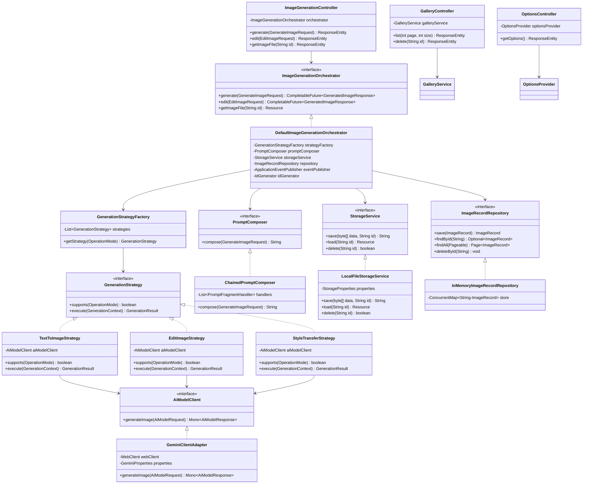
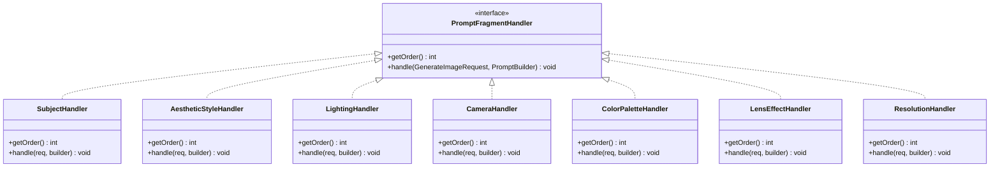
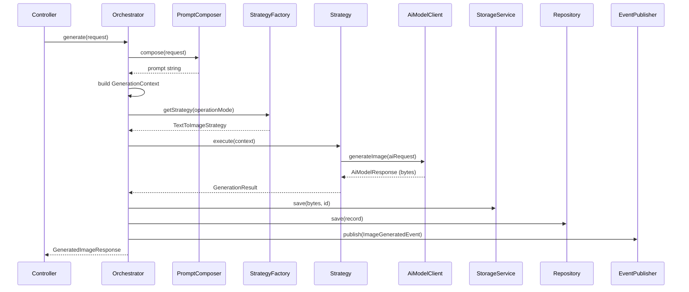

# 📐 Zero-Prompt Creative Studio — Low-Level Design (LLD)

## Table of Contents

- [1. SOLID Principles & Design Patterns Applied](#1-solid-principles--design-patterns-applied)
- [2. Class Diagrams](#2-class-diagrams)
- [3. Backend LLD — Interfaces & Contracts](#3-backend-lld--interfaces--contracts)
- [4. Backend LLD — Implementations](#4-backend-lld--implementations)
- [5. Prompt Composition — Chain of Responsibility](#5-prompt-composition--chain-of-responsibility)
- [6. Generation — Strategy Pattern](#6-generation--strategy-pattern)
- [7. Frontend LLD](#7-frontend-lld)
- [8. Error Handling — Exception Hierarchy](#8-error-handling--exception-hierarchy)
- [9. Configuration & Security](#9-configuration--security)

---

## 1. SOLID Principles & Design Patterns Applied

### SOLID Compliance Matrix

| Principle | How Applied | Where |
|:---|:---|:---|
| **S — Single Responsibility** | Each class has exactly one reason to change. Controller only handles HTTP. Service only orchestrates. Client only calls API. | All layers |
| **O — Open/Closed** | New operation modes (e.g., `VIDEO_GENERATION`) added by creating a new `GenerationStrategy` — zero changes to existing code. New prompt fragments added by registering a new `PromptFragmentHandler`. | Strategy, Chain of Responsibility |
| **L — Liskov Substitution** | All `GenerationStrategy` implementations are interchangeable. Any `StorageService` impl (local, S3, GCS) works identically. | Strategy, Repository |
| **I — Interface Segregation** | `AiModelClient` only exposes `generate()`. `StorageService` only exposes CRUD. No fat interfaces. | All interfaces |
| **D — Dependency Inversion** | Controllers depend on `ImageGenerationOrchestrator` (interface), not concrete service. Services depend on `AiModelClient` (interface), not `GeminiClientService`. | All layers |

### Design Patterns Used

| Pattern | Where | Purpose |
|:---|:---|:---|
| **Strategy** | `GenerationStrategy` | Different logic per operation mode (Text-to-Image, Edit, Style Transfer) without `if-else` chains |
| **Chain of Responsibility** | `PromptFragmentHandler` | Composable, ordered prompt building — each handler appends its fragment independently |
| **Factory** | `GenerationStrategyFactory` | Resolves the correct strategy from `OperationMode` at runtime |
| **Builder** | `PromptBuilder`, `GeminiRequestConfig` | Fluent, immutable object construction |
| **Template Method** | `AbstractGenerationStrategy` | Common generation workflow (compose → call API → save → record), subclasses override specific steps |
| **Repository** | `ImageRecordRepository` | Data access abstraction, decoupled from storage implementation |
| **Observer** | Spring `ApplicationEventPublisher` | `ImageGeneratedEvent` emitted after generation — gallery, analytics, and notifications react independently |
| **Adapter** | `GeminiClientAdapter` | Adapts the external Gemini API response format into our internal `GenerationResult` domain model |

---

## 2. Class Diagrams

### 2.1 Backend — Full Class Diagram (SOLID)



### 2.2 Prompt Chain of Responsibility



### 2.3 Strategy Pattern — Generation Flow



---

## 3. Backend LLD — Interfaces & Contracts

### 3.1 Core Interfaces (Dependency Inversion Principle)

```java
// ═══════════════════════════════════════════════════════════════
// ORCHESTRATOR — Single entry point for generation workflows
// SRP: Only orchestrates. Does NOT compose prompts, call AI, or save files.
// ═══════════════════════════════════════════════════════════════
public interface ImageGenerationOrchestrator {
    CompletableFuture<GeneratedImageResponse> generate(GenerateImageRequest request);
    CompletableFuture<GeneratedImageResponse> edit(EditImageRequest request);
    Resource getImageFile(String id);
}

// ═══════════════════════════════════════════════════════════════
// STRATEGY — One implementation per OperationMode (Open/Closed)
// Adding VIDEO_GENERATION = new class, zero changes to existing code
// ═══════════════════════════════════════════════════════════════
public interface GenerationStrategy {
    boolean supports(OperationMode mode);
    GenerationResult execute(GenerationContext context);
}

// ═══════════════════════════════════════════════════════════════
// AI MODEL CLIENT — Abstracts the AI provider (DIP)
// Swap Gemini for OpenAI/Stability by implementing this interface
// ═══════════════════════════════════════════════════════════════
public interface AiModelClient {
    Mono<AiModelResponse> generateImage(AiModelRequest request);
}

// ═══════════════════════════════════════════════════════════════
// PROMPT COMPOSER — Abstracts prompt building strategy (DIP)
// ═══════════════════════════════════════════════════════════════
public interface PromptComposer {
    String compose(GenerateImageRequest request);
}

// ═══════════════════════════════════════════════════════════════
// PROMPT FRAGMENT HANDLER — One per dropdown category (SRP, OCP)
// Chain of Responsibility: each handler appends its fragment
// ═══════════════════════════════════════════════════════════════
public interface PromptFragmentHandler extends Ordered {
    void handle(GenerateImageRequest request, PromptBuilder builder);
}

// ═══════════════════════════════════════════════════════════════
// STORAGE — Interface Segregation: only CRUD, no business logic
// ═══════════════════════════════════════════════════════════════
public interface StorageService {
    String save(byte[] data, String id);
    Resource load(String id);
    boolean delete(String id);
    boolean exists(String id);
}

// ═══════════════════════════════════════════════════════════════
// REPOSITORY — Data access abstraction (SRP + DIP)
// ═══════════════════════════════════════════════════════════════
public interface ImageRecordRepository {
    ImageRecord save(ImageRecord record);
    Optional<ImageRecord> findById(String id);
    Page<ImageRecord> findAll(Pageable pageable);
    void deleteById(String id);
}
```

### 3.2 Domain Models (Immutable, Builder Pattern)

```java
@Value
@Builder
public class GenerationContext {
    String id;
    String prompt;
    GenerateImageRequest originalRequest;
    GeminiRequestConfig aiConfig;
}

@Value
@Builder
public class GenerationResult {
    byte[] imageData;
    String mimeType;
    Map<String, Object> modelMetadata;
}

@Value
@Builder
public class AiModelRequest {
    String prompt;
    String model;
    ThinkingLevel thinkingLevel;
    String aspectRatio;
    int width;
    int height;
    @Nullable byte[] sourceImage;      // For edit/style transfer
    @Nullable StyleIntensity intensity; // For style transfer
}

@Value
@Builder
public class AiModelResponse {
    byte[] imageData;
    String mimeType;
    long processingTimeMs;
}

// Builder for fluent prompt construction
public class PromptBuilder {
    private final StringBuilder subject = new StringBuilder();
    private final List<String> fragments = new ArrayList<>();

    public PromptBuilder subject(String text)   { subject.append(text); return this; }
    public PromptBuilder append(String fragment) { fragments.add(fragment); return this; }

    public String build() {
        if (fragments.isEmpty()) return subject.toString();
        return subject + ", " + String.join(", ", fragments);
    }
}
```

### 3.3 DTOs with Validation

```java
@Data
@Builder
public class GenerateImageRequest {
    @NotBlank(message = "Subject is required")
    @Size(max = 500, message = "Subject must be under 500 characters")
    private String subject;

    @NotNull(message = "Operation mode is required")
    private OperationMode operationMode;

    private AestheticStyle aestheticStyle;  // All optional — nullable
    private LightingSetup lighting;
    private CameraComposition cameraComposition;
    private ColorPalette colorPalette;
    private LensEffect lensEffect;

    @NotNull private AspectRatio aspectRatio;
    @NotNull private ResolutionQuality resolution;
    @NotNull private ThinkingLevel thinkingLevel;
    private StyleIntensity styleIntensity;
}

@Data @Builder
public class EditImageRequest {
    @NotBlank private String subject;
    @NotBlank private String sourceImageBase64;
    @NotNull  private OperationMode operationMode;
    private AestheticStyle aestheticStyle;
    private LightingSetup lighting;
    private StyleIntensity styleIntensity;
}

@Value @Builder
public class GeneratedImageResponse {
    String id;
    String imageUrl;
    String prompt;
    long generationTimeMs;
    ImageMetadata metadata;
}

@Value @Builder
public class ImageMetadata {
    String model;
    ThinkingLevel thinkingLevel;
    String aspectRatio;
    String resolution;
    LocalDateTime createdAt;
}

@Value @Builder
public class ErrorResponse {
    String error;
    String message;
    LocalDateTime timestamp;
    @Nullable Integer retryAfterSeconds;
}
```

### 3.4 Enums with Encapsulated Behavior

```java
@Getter @RequiredArgsConstructor
public enum AestheticStyle implements PromptDescribable {
    PHOTOREALISTIC("Photorealistic", "photorealistic"),
    ISOMETRIC_3D("Isometric 3D", "isometric 3D rendered"),
    FLAT_VECTOR("Flat Vector", "flat vector illustration"),
    CINEMATIC("Cinematic", "cinematic film still"),
    CYBERPUNK("Cyberpunk", "cyberpunk neon-drenched"),
    WATERCOLOR("Watercolor", "traditional watercolor painting"),
    SKETCH("Sketch", "detailed charcoal sketch"),
    POP_ART("Pop Art", "bold pop art");

    private final String displayName;
    private final String promptFragment;
}

// All enums implement this — no need for external mapper (SRP in enum)
public interface PromptDescribable {
    String getPromptFragment();
}

@Getter @RequiredArgsConstructor
public enum AspectRatio {
    RATIO_1_1("1:1 (Square)", "1:1"),
    RATIO_16_9("16:9 (Landscape)", "16:9"),
    RATIO_9_16("9:16 (Vertical)", "9:16"),
    RATIO_4_3("4:3 (Standard)", "4:3"),
    RATIO_21_9("21:9 (Cinematic)", "21:9");

    private final String displayName;
    private final String apiValue;
}

@Getter @RequiredArgsConstructor
public enum ResolutionQuality {
    DRAFT("Draft", 512, 512),
    STANDARD("Standard", 1024, 1024),
    PRODUCTION("Production", 2048, 2048);

    private final String displayName;
    private final int width;
    private final int height;
}

@Getter @RequiredArgsConstructor
public enum ThinkingLevel {
    FAST("Fast", "minimal"),
    CREATIVE("Creative", "high");

    private final String displayName;
    private final String apiValue;
}
```

---

## 4. Backend LLD — Implementations

### 4.1 Orchestrator (Template Method + Event-Driven)

```java
@Service
@RequiredArgsConstructor
@Slf4j
public class DefaultImageGenerationOrchestrator implements ImageGenerationOrchestrator {

    private final PromptComposer promptComposer;
    private final GenerationStrategyFactory strategyFactory;
    private final StorageService storageService;
    private final ImageRecordRepository repository;
    private final ApplicationEventPublisher eventPublisher;
    private final IdGenerator idGenerator;

    @Override
    @Async("generationExecutor")
    public CompletableFuture<GeneratedImageResponse> generate(GenerateImageRequest request) {
        long startTime = System.currentTimeMillis();
        String imageId = idGenerator.next();

        // 1. Compose prompt (Chain of Responsibility)
        String prompt = promptComposer.compose(request);

        // 2. Build context
        GenerationContext context = GenerationContext.builder()
            .id(imageId)
            .prompt(prompt)
            .originalRequest(request)
            .aiConfig(buildAiConfig(request))
            .build();

        // 3. Resolve & execute strategy (Strategy Pattern)
        GenerationStrategy strategy = strategyFactory.getStrategy(request.getOperationMode());
        GenerationResult result = strategy.execute(context);

        // 4. Persist image (Repository Pattern)
        String filePath = storageService.save(result.getImageData(), imageId);

        long elapsed = System.currentTimeMillis() - startTime;
        ImageRecord record = ImageRecord.builder()
            .id(imageId).filePath(filePath).prompt(prompt)
            .operationMode(request.getOperationMode())
            .generationTimeMs(elapsed)
            .createdAt(LocalDateTime.now())
            .build();
        repository.save(record);

        // 5. Publish event (Observer Pattern) — decoupled side effects
        eventPublisher.publishEvent(new ImageGeneratedEvent(this, record));

        // 6. Map to response
        return CompletableFuture.completedFuture(toResponse(imageId, prompt, elapsed, request));
    }

    @Override
    public Resource getImageFile(String id) {
        return repository.findById(id)
            .map(record -> storageService.load(id))
            .orElseThrow(() -> new ImageNotFoundException(id));
    }

    private GeminiRequestConfig buildAiConfig(GenerateImageRequest req) {
        return GeminiRequestConfig.builder()
            .model("gemini-3.1-flash-image-preview")
            .thinkingLevel(req.getThinkingLevel())
            .aspectRatio(req.getAspectRatio().getApiValue())
            .imageWidth(req.getResolution().getWidth())
            .imageHeight(req.getResolution().getHeight())
            .build();
    }

    private GeneratedImageResponse toResponse(String id, String prompt, long elapsed,
                                               GenerateImageRequest req) {
        return GeneratedImageResponse.builder()
            .id(id)
            .imageUrl("/api/v1/images/" + id + "/file")
            .prompt(prompt)
            .generationTimeMs(elapsed)
            .metadata(ImageMetadata.builder()
                .model("gemini-3.1-flash-image-preview")
                .thinkingLevel(req.getThinkingLevel())
                .aspectRatio(req.getAspectRatio().getApiValue())
                .resolution(req.getResolution().name())
                .createdAt(LocalDateTime.now())
                .build())
            .build();
    }
}
```

### 4.2 Controller (Thin — SRP)

```java
@RestController
@RequestMapping("/api/v1/images")
@RequiredArgsConstructor
@Slf4j
@Tag(name = "Image Generation")
public class ImageGenerationController {

    // Depends on interface, not concrete (DIP)
    private final ImageGenerationOrchestrator orchestrator;

    @PostMapping("/generate")
    public CompletableFuture<ResponseEntity<GeneratedImageResponse>> generate(
            @Valid @RequestBody GenerateImageRequest request) {
        log.info("Generate: mode={}, style={}", request.getOperationMode(), request.getAestheticStyle());
        return orchestrator.generate(request).thenApply(ResponseEntity::ok);
    }

    @PostMapping("/edit")
    public CompletableFuture<ResponseEntity<GeneratedImageResponse>> edit(
            @Valid @RequestBody EditImageRequest request) {
        return orchestrator.edit(request).thenApply(ResponseEntity::ok);
    }

    @GetMapping("/{id}/file")
    public ResponseEntity<Resource> getFile(@PathVariable String id) {
        return ResponseEntity.ok().contentType(MediaType.IMAGE_PNG).body(orchestrator.getImageFile(id));
    }
}
```

---

## 5. Prompt Composition — Chain of Responsibility

### 5.1 Fragment Handlers (OCP: add new handler = zero changes to existing)

```java
// Each handler is a standalone @Component — SRP
// Ordered by getOrder() — the chain assembles automatically via Spring DI

@Component @Order(0)
public class SubjectHandler implements PromptFragmentHandler {
    @Override public int getOrder() { return 0; }
    @Override public void handle(GenerateImageRequest req, PromptBuilder builder) {
        builder.subject(req.getSubject());
    }
}

@Component @Order(1)
public class AestheticStyleHandler implements PromptFragmentHandler {
    @Override public int getOrder() { return 1; }
    @Override public void handle(GenerateImageRequest req, PromptBuilder builder) {
        if (req.getAestheticStyle() != null) {
            builder.append("rendered in a " + req.getAestheticStyle().getPromptFragment() + " aesthetic");
        }
    }
}

@Component @Order(2)
public class LightingHandler implements PromptFragmentHandler {
    @Override public int getOrder() { return 2; }
    @Override public void handle(GenerateImageRequest req, PromptBuilder builder) {
        if (req.getLighting() != null) {
            builder.append("illuminated with " + req.getLighting().getPromptFragment() + " lighting");
        }
    }
}

@Component @Order(3)
public class CameraHandler implements PromptFragmentHandler {
    @Override public int getOrder() { return 3; }
    @Override public void handle(GenerateImageRequest req, PromptBuilder builder) {
        if (req.getCameraComposition() != null) {
            builder.append("shot from a " + req.getCameraComposition().getPromptFragment() + " perspective");
        }
    }
}

@Component @Order(4)
public class ColorPaletteHandler implements PromptFragmentHandler {
    @Override public int getOrder() { return 4; }
    @Override public void handle(GenerateImageRequest req, PromptBuilder builder) {
        if (req.getColorPalette() != null) {
            builder.append("utilizing a " + req.getColorPalette().getPromptFragment() + " color palette");
        }
    }
}

@Component @Order(5)
public class LensEffectHandler implements PromptFragmentHandler {
    @Override public int getOrder() { return 5; }
    @Override public void handle(GenerateImageRequest req, PromptBuilder builder) {
        if (req.getLensEffect() != null) {
            builder.append("featuring " + req.getLensEffect().getPromptFragment() + " photography techniques");
        }
    }
}

@Component @Order(6)
public class ResolutionHandler implements PromptFragmentHandler {
    @Override public int getOrder() { return 6; }
    @Override public void handle(GenerateImageRequest req, PromptBuilder builder) {
        if (req.getResolution() != null) {
            builder.append("highly detailed, " + req.getResolution().getDisplayName() + " resolution");
        }
    }
}
```

### 5.2 Chained Composer (Assembles handlers via Spring DI)

```java
@Service
@Slf4j
public class ChainedPromptComposer implements PromptComposer {

    private final List<PromptFragmentHandler> handlers; // Injected in order

    // Spring auto-sorts @Order components (OCP: new handler = new @Component)
    public ChainedPromptComposer(List<PromptFragmentHandler> handlers) {
        this.handlers = handlers;
    }

    @Override
    public String compose(GenerateImageRequest request) {
        PromptBuilder builder = new PromptBuilder();
        handlers.forEach(handler -> handler.handle(request, builder));
        String prompt = builder.build();
        log.info("Composed prompt ({} handlers): {}", handlers.size(), prompt);
        return prompt;
    }
}
```

---

## 6. Generation — Strategy Pattern

### 6.1 Strategy Factory

```java
@Component
@RequiredArgsConstructor
public class GenerationStrategyFactory {

    private final List<GenerationStrategy> strategies; // All strategies injected

    public GenerationStrategy getStrategy(OperationMode mode) {
        return strategies.stream()
            .filter(s -> s.supports(mode))
            .findFirst()
            .orElseThrow(() -> new UnsupportedOperationException(
                "No strategy registered for mode: " + mode));
    }
}
```

### 6.2 Concrete Strategies (LSP: all interchangeable)

```java
@Component
@RequiredArgsConstructor
@Slf4j
public class TextToImageStrategy implements GenerationStrategy {

    private final AiModelClient aiModelClient;

    @Override
    public boolean supports(OperationMode mode) {
        return mode == OperationMode.TEXT_TO_IMAGE;
    }

    @Override
    public GenerationResult execute(GenerationContext ctx) {
        log.info("Executing TEXT_TO_IMAGE strategy for id={}", ctx.getId());
        AiModelRequest aiRequest = AiModelRequest.builder()
            .prompt(ctx.getPrompt())
            .model(ctx.getAiConfig().getModel())
            .thinkingLevel(ctx.getAiConfig().getThinkingLevel())
            .aspectRatio(ctx.getAiConfig().getAspectRatio())
            .width(ctx.getAiConfig().getImageWidth())
            .height(ctx.getAiConfig().getImageHeight())
            .build();

        AiModelResponse response = aiModelClient.generateImage(aiRequest)
            .block(Duration.ofSeconds(30));

        return GenerationResult.builder()
            .imageData(response.getImageData())
            .mimeType(response.getMimeType())
            .build();
    }
}

@Component
@RequiredArgsConstructor
@Slf4j
public class EditImageStrategy implements GenerationStrategy {

    private final AiModelClient aiModelClient;

    @Override
    public boolean supports(OperationMode mode) {
        return mode == OperationMode.EDIT_EXISTING;
    }

    @Override
    public GenerationResult execute(GenerationContext ctx) {
        log.info("Executing EDIT_EXISTING strategy for id={}", ctx.getId());
        // Edit-specific logic: attach source image to request
        AiModelRequest aiRequest = AiModelRequest.builder()
            .prompt(ctx.getPrompt())
            .model(ctx.getAiConfig().getModel())
            .thinkingLevel(ctx.getAiConfig().getThinkingLevel())
            .aspectRatio(ctx.getAiConfig().getAspectRatio())
            .width(ctx.getAiConfig().getImageWidth())
            .height(ctx.getAiConfig().getImageHeight())
            .sourceImage(ctx.getSourceImageBytes())
            .build();

        AiModelResponse response = aiModelClient.generateImage(aiRequest)
            .block(Duration.ofSeconds(30));

        return GenerationResult.builder()
            .imageData(response.getImageData())
            .mimeType(response.getMimeType())
            .build();
    }
}

@Component
@RequiredArgsConstructor
@Slf4j
public class StyleTransferStrategy implements GenerationStrategy {

    private final AiModelClient aiModelClient;

    @Override
    public boolean supports(OperationMode mode) {
        return mode == OperationMode.STYLE_TRANSFER;
    }

    @Override
    public GenerationResult execute(GenerationContext ctx) {
        log.info("Executing STYLE_TRANSFER strategy for id={}", ctx.getId());
        AiModelRequest aiRequest = AiModelRequest.builder()
            .prompt(ctx.getPrompt())
            .model(ctx.getAiConfig().getModel())
            .sourceImage(ctx.getSourceImageBytes())
            .intensity(ctx.getOriginalRequest().getStyleIntensity())
            .build();

        AiModelResponse response = aiModelClient.generateImage(aiRequest)
            .block(Duration.ofSeconds(30));

        return GenerationResult.builder()
            .imageData(response.getImageData())
            .mimeType(response.getMimeType())
            .build();
    }
}
```

### 6.3 Gemini Adapter (Adapter Pattern — isolates external API)

```java
@Service
@RequiredArgsConstructor
@Slf4j
public class GeminiClientAdapter implements AiModelClient {

    private final WebClient webClient;
    private final GeminiProperties properties;

    private static final String API_URL =
        "https://generativelanguage.googleapis.com/v1beta/models/{model}:generateContent";

    @Override
    public Mono<AiModelResponse> generateImage(AiModelRequest request) {
        long start = System.currentTimeMillis();
        Map<String, Object> body = buildGeminiRequestBody(request);

        return webClient.post()
            .uri(API_URL, request.getModel())
            .header("x-goog-api-key", properties.getApiKey())
            .contentType(MediaType.APPLICATION_JSON)
            .bodyValue(body)
            .retrieve()
            .onStatus(HttpStatusCode::is4xxClientError, resp ->
                resp.bodyToMono(String.class)
                    .flatMap(b -> Mono.error(new GeminiApiException("Client error: " + b))))
            .onStatus(status -> status.value() == 429, resp ->
                Mono.error(new QuotaExceededException(60)))
            .onStatus(HttpStatusCode::is5xxServerError, resp ->
                Mono.error(new GeminiApiException("Gemini API unavailable")))
            .bodyToMono(new ParameterizedTypeReference<Map<String, Object>>() {})
            .map(responseMap -> adaptToAiModelResponse(responseMap, start))
            .timeout(Duration.ofSeconds(properties.getTimeoutSeconds()))
            .doOnError(e -> log.error("Gemini API call failed", e));
    }

    // Adapter: converts external Gemini response → internal AiModelResponse
    private AiModelResponse adaptToAiModelResponse(Map<String, Object> raw, long start) {
        byte[] imageData = GeminiResponseParser.extractImageBytes(raw);
        return AiModelResponse.builder()
            .imageData(imageData)
            .mimeType("image/png")
            .processingTimeMs(System.currentTimeMillis() - start)
            .build();
    }

    private Map<String, Object> buildGeminiRequestBody(AiModelRequest req) {
        List<Map<String, Object>> parts = new ArrayList<>();
        parts.add(Map.of("text", req.getPrompt()));
        if (req.getSourceImage() != null) {
            parts.add(Map.of("inlineData", Map.of(
                "mimeType", "image/png",
                "data", Base64.getEncoder().encodeToString(req.getSourceImage())
            )));
        }
        return Map.of(
            "contents", List.of(Map.of("parts", parts)),
            "generationConfig", Map.of(
                "responseModalities", List.of("IMAGE", "TEXT"),
                "imageDimension", Map.of("aspectRatio", req.getAspectRatio())
            )
        );
    }
}
```

### 6.4 Event Listener (Observer — decoupled side effects)

```java
// Observer: reacts to generation events without coupling to orchestrator
@Component
@RequiredArgsConstructor
@Slf4j
public class GalleryEventListener {

    @EventListener
    @Async
    public void onImageGenerated(ImageGeneratedEvent event) {
        log.info("Image generated: id={}, timeMs={}",
            event.getRecord().getId(), event.getRecord().getGenerationTimeMs());
        // Future: analytics, notifications, usage tracking
    }
}

public class ImageGeneratedEvent extends ApplicationEvent {
    @Getter private final ImageRecord record;

    public ImageGeneratedEvent(Object source, ImageRecord record) {
        super(source);
        this.record = record;
    }
}
```

---

## 7. Frontend LLD

### 7.1 Zustand Stores (unchanged — already clean)

Stores from the previous design are well-structured. Key improvements:

```typescript
// types/studio.types.ts — Discriminated union types for type safety
export interface GenerateImagePayload {
  subject: string;
  operationMode: OperationMode;
  aestheticStyle?: AestheticStyle;
  lighting?: LightingSetup;
  cameraComposition?: CameraComposition;
  colorPalette?: ColorPalette;
  lensEffect?: LensEffect;
  aspectRatio: AspectRatio;
  resolution: ResolutionQuality;
  thinkingLevel: ThinkingLevel;
  styleIntensity?: StyleIntensity;
  sourceImageBase64?: string;
}

// api/imageApi.ts — Typed responses, no `any`
export const imageApi = {
  generateImage: async (payload: GenerateImagePayload): Promise<GeneratedImageResponse> => {
    const { data } = await apiClient.post<GeneratedImageResponse>(
      '/api/v1/images/generate', payload);
    return data;
  },
  // ...
};
```

### 7.2 Custom Hooks — Separation of Concerns

```typescript
// hooks/useImageGeneration.ts — SRP: encapsulates generation logic
export function useImageGeneration() {
  const studioStore = useStudioStore();
  const generationStore = useGenerationStore();

  const generate = useCallback(async () => {
    const payload = studioStore.toRequestPayload();
    await generationStore.generate(payload);
  }, [studioStore, generationStore]);

  const isGenerating = generationStore.status === 'loading';
  const canGenerate = studioStore.subject.trim().length > 0 && !isGenerating;

  return { generate, isGenerating, canGenerate };
}

// hooks/useOperationMode.ts — SRP: mode-specific UI logic
export function useOperationMode() {
  const mode = useStudioStore(s => s.operationMode);

  const showImageUpload = mode === 'EDIT_EXISTING' || mode === 'STYLE_TRANSFER';
  const showStyleIntensity = mode === 'STYLE_TRANSFER';
  const subjectPlaceholder = mode === 'EDIT_EXISTING'
    ? 'Describe the edit...'
    : 'Describe your image...';

  return { mode, showImageUpload, showStyleIntensity, subjectPlaceholder };
}
```

### 7.3 MUI Theme — `cosmicDarkTheme` (unchanged from previous)

The theme configuration remains the same — already properly structured using MUI's design system.

---

## 8. Error Handling — Exception Hierarchy

```java
// Base exception — all app exceptions extend this (LSP)
public abstract class ZpcsException extends RuntimeException {
    public abstract HttpStatus getHttpStatus();
    public abstract String getErrorCode();

    protected ZpcsException(String message) { super(message); }
    protected ZpcsException(String message, Throwable cause) { super(message, cause); }
}

public class GeminiApiException extends ZpcsException {
    @Override public HttpStatus getHttpStatus() { return HttpStatus.BAD_GATEWAY; }
    @Override public String getErrorCode() { return "UPSTREAM_ERROR"; }
    public GeminiApiException(String msg) { super(msg); }
}

public class QuotaExceededException extends ZpcsException {
    @Getter private final int retryAfterSeconds;
    @Override public HttpStatus getHttpStatus() { return HttpStatus.TOO_MANY_REQUESTS; }
    @Override public String getErrorCode() { return "QUOTA_EXCEEDED"; }
    public QuotaExceededException(int retryAfter) {
        super("Rate limit exceeded"); this.retryAfterSeconds = retryAfter;
    }
}

public class ImageNotFoundException extends ZpcsException {
    @Override public HttpStatus getHttpStatus() { return HttpStatus.NOT_FOUND; }
    @Override public String getErrorCode() { return "NOT_FOUND"; }
    public ImageNotFoundException(String id) { super("Image not found: " + id); }
}

// Single handler — uses polymorphism instead of multiple catch blocks (LSP)
@ControllerAdvice
@Slf4j
public class GlobalExceptionHandler {

    @ExceptionHandler(ZpcsException.class)
    public ResponseEntity<ErrorResponse> handleAppException(ZpcsException ex) {
        log.warn("App exception: {} - {}", ex.getErrorCode(), ex.getMessage());
        ErrorResponse body = ErrorResponse.builder()
            .error(ex.getErrorCode())
            .message(ex.getMessage())
            .timestamp(LocalDateTime.now())
            .retryAfterSeconds(ex instanceof QuotaExceededException q ? q.getRetryAfterSeconds() : null)
            .build();
        return ResponseEntity.status(ex.getHttpStatus()).body(body);
    }

    @ExceptionHandler(MethodArgumentNotValidException.class)
    public ResponseEntity<ErrorResponse> handleValidation(MethodArgumentNotValidException ex) {
        String message = ex.getBindingResult().getFieldErrors().stream()
            .map(e -> e.getField() + ": " + e.getDefaultMessage())
            .collect(Collectors.joining(", "));
        return ResponseEntity.badRequest().body(ErrorResponse.builder()
            .error("VALIDATION_ERROR").message(message).timestamp(LocalDateTime.now()).build());
    }
}
```

---

## 9. Configuration & Security

### 9.1 Configuration Properties (Type-safe)

```java
@ConfigurationProperties(prefix = "gemini")
@Validated
@Data
public class GeminiProperties {
    @NotBlank private String apiKey;
    @NotBlank private String model = "gemini-3.1-flash-image-preview";
    @Min(5) @Max(120) private int timeoutSeconds = 30;
    @Min(0) @Max(5)   private int maxRetries = 2;
}

@ConfigurationProperties(prefix = "storage")
@Validated
@Data
public class StorageProperties {
    @NotBlank private String basePath = "./generated-images";
}
```

### 9.2 Async Configuration

```java
@Configuration
@EnableAsync
public class AsyncConfig {
    @Bean("generationExecutor")
    public Executor generationExecutor() {
        ThreadPoolTaskExecutor executor = new ThreadPoolTaskExecutor();
        executor.setCorePoolSize(4);
        executor.setMaxPoolSize(10);
        executor.setQueueCapacity(50);
        executor.setThreadNamePrefix("gen-");
        executor.setRejectedExecutionHandler(new ThreadPoolExecutor.CallerRunsPolicy());
        executor.initialize();
        return executor;
    }
}
```

### 9.3 Security Matrix

| Concern | Implementation | Principle |
|:---|:---|:---|
| API Key protection | `GeminiProperties` server-side only | SRP — config isolated |
| CORS | `CorsConfig` with strict origin whitelist | ISP — separate config concern |
| Input validation | `@Valid` + `@NotBlank` / `@Size` on DTOs | SRP — validation in DTO |
| Rate limiting | `RateLimitFilter` per IP | SRP — cross-cutting concern |
| File paths | UUID-based, no user input in paths | Security by design |
| Error exposure | `GlobalExceptionHandler` — never leaks stack traces | SRP — error mapping |
